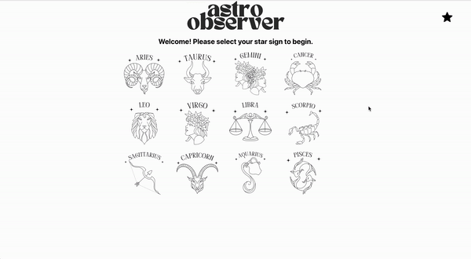

# Astro Observer

This project was created by [Paulina Rubio](https://www.linkedin.com/in/paulina-isabel-rubio/).

## Summary

Astro Observer is an astrology app. Select your (or a loved one's) star sign on the home page to be directed to that sign's page. There, you can select what time period you would love to receive an astrological reading from. Choose today, yesterday, or this week - you will see a reading based on that choice. You may favorite a reading and view it in a favorites page by clicking the star displayed below the reading. Navigate to your favorites page via the star icon on the top right of the page. Unfavorite any readings that no longer serve you if you wish. 

## Technologies Used

  
  
  
  
  

## Preview of App:
  

[Deployed Link Here](https://astro-observer.vercel.app/)
 

## Installation Instructions:
- Fork this repository. 
- Clone it to your local machine using the command: `git clone git@github.com:paulina-isabel/astros-observer.git`.
- Run the command: `cd astro-observer`
- Run the command: `npm install`
- Run the command: `npm start`

